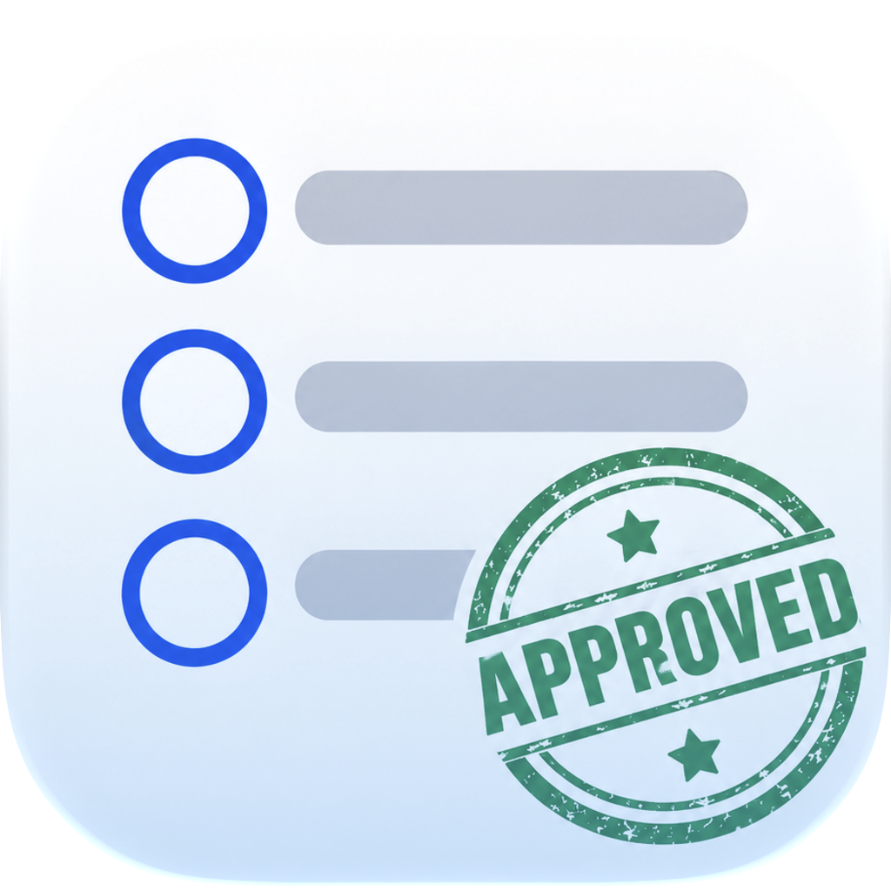
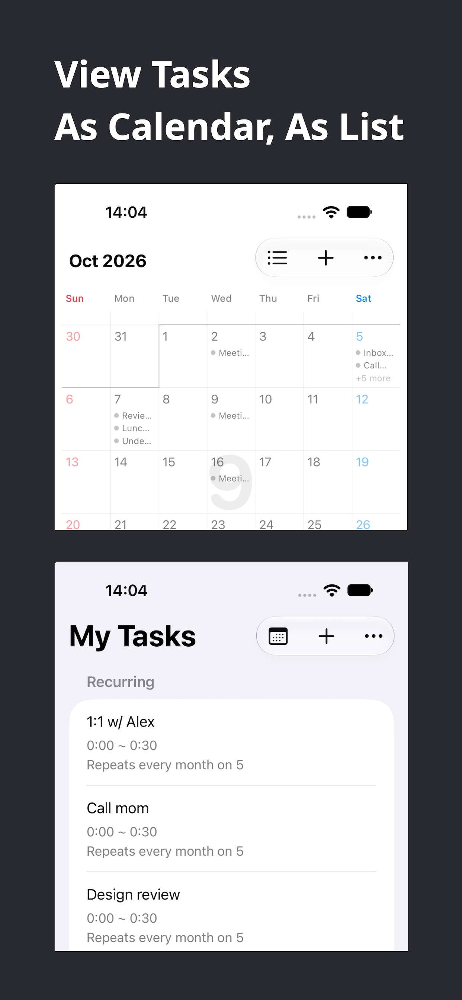
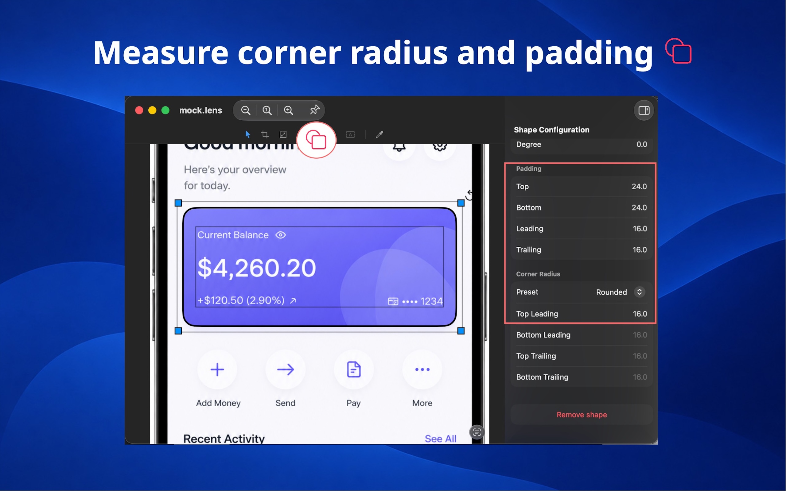
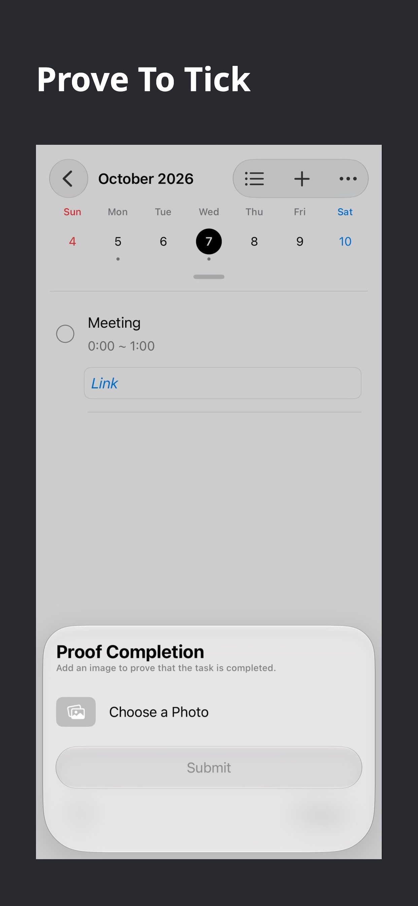
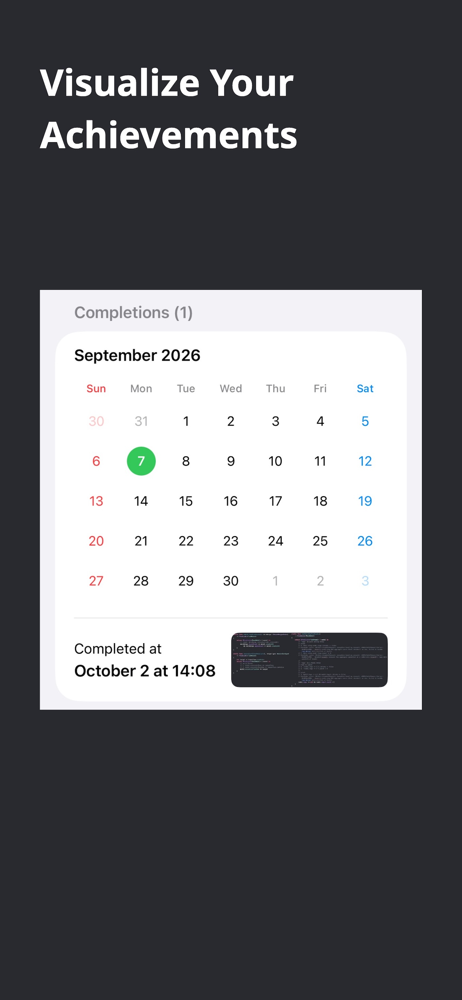

#  Proof Tick

### **Prove to tick.**

Stop checking boxes. Show your work instead.

---

Proof Tick is a to-do list with one simple rule:
**you can't tick a task until you prove you did it.**

Add your tasks, then submit a photo when they're done. Your proof becomes part
of the completion record.

Whether it's cleaning your desk, taking out the trash, finishing a project, or
getting something done around the house, just show it and tick it.

---

## Screenshots

  
  
  
  

---

## Download

[Download on the App Store](https://apps.apple.com/us/app/id6818395009)

---

Contact me at itsuki.enjoy@gmail.com
 
© 2026 Itsuki

