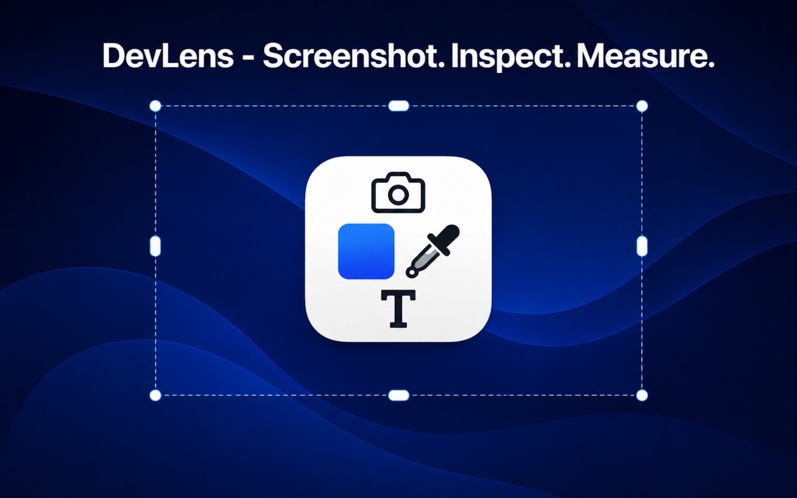
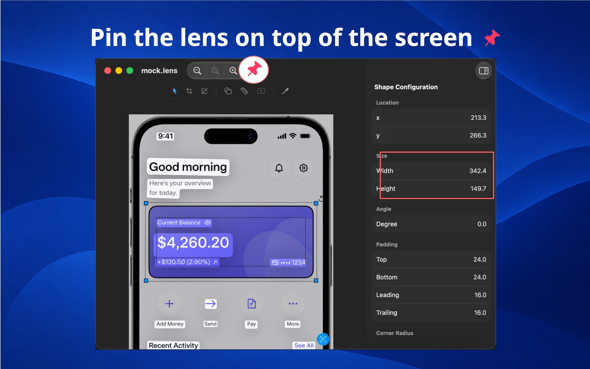

#  DevLens

**Inspect any screenshot with pixel precision. Measure spacing, padding, radius
and colors, extract text instantly, and keep references pinned while you
build.**

---

### **Build pixel-perfect UIs from any screenshot.**

Whether you're implementing an AI-generated mockup, a client-provided PNG, an
App Store screenshot, or a beautiful UI you found online, DevLens helps you
inspect and measure exactly what you see.

Design files aren't always available. And even when they are, measurements from
design tools don't always translate perfectly to iOS and macOS. DevLens gives
you a fast, visual workflow to inspect the final rendered result instead.

---

## Built for real development workflows

**AI-generated mockups**

AI can generate beautiful UI concepts, but they're often delivered as images.
When your client expects a pixel-perfect implementation, DevLens lets you
inspect every detail without guessing.

**Client screenshots**

Many clients send PNGs instead of design files. No layers. No measurements. No
typography information. Just an image.

DevLens turns that screenshot into a reference you can actually work with.

**Reverse engineer great interfaces**

Found an interface you love? Inspect its spacing, colors, and layout to better
understand how it's put together.

**Verify designs**

Measurements from design tools sometimes don't match what you see on the actual
device. DevLens helps you inspect the rendered result, making it easier to
fine-tune your implementation.

---

## Measure with precision

Stop estimating.

• Measure any distance with a simple ruler • Check spacing and padding visually
• Match corner radius with adjustable overlays • Pick colors instantly • Zoom in
for pixel-level inspection

Everything is measured directly from the image, giving you reliable pixel
measurements without unnecessary complexity.

---

## Extract text instantly

No more retyping UI copy.

Select text directly from screenshots and copy it to your clipboard, ready to
paste into your project.

Perfect for:

• Button titles • Labels • Error messages • Marketing copy • UI strings

---

## Keep references where you need them

Every screenshot opens in its own lightweight floating window.

Pin screenshots above your workspace, arrange multiple references side by side,
and keep them visible while you code.

No constantly switching between Preview, Finder, or browser tabs.

---

## Designed for developers

DevLens focuses on the information engineers actually need:

- Pixel measurements
- Spacing and padding
- Corner radius
- Color values
- Text extraction
- Always-on-top reference windows

No clutter. No unnecessary editing tools. Just the fastest way to inspect
screenshots and build interfaces with confidence.

---

## Screenshots

  
  

  
  
  

---

## Download

[Download on the App Store](https://apps.apple.com/us/app/id6786170387)

---

© 2026 Itsuki

